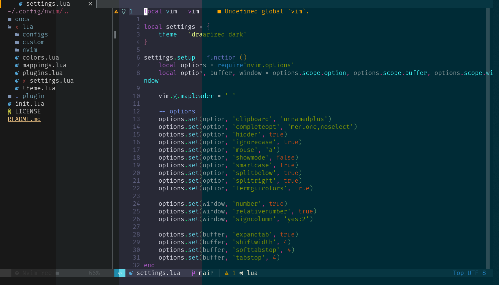
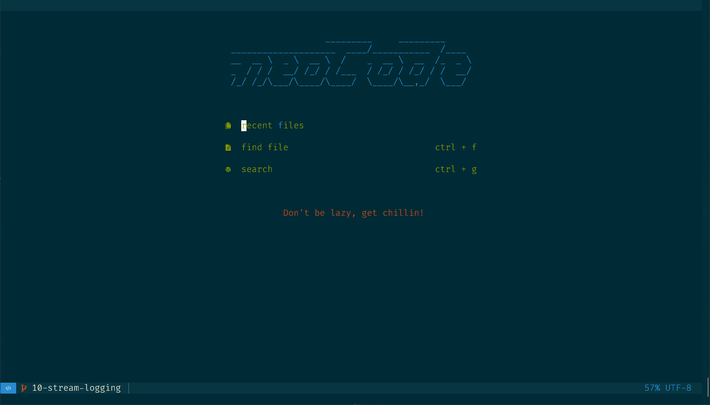
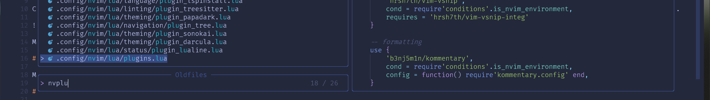
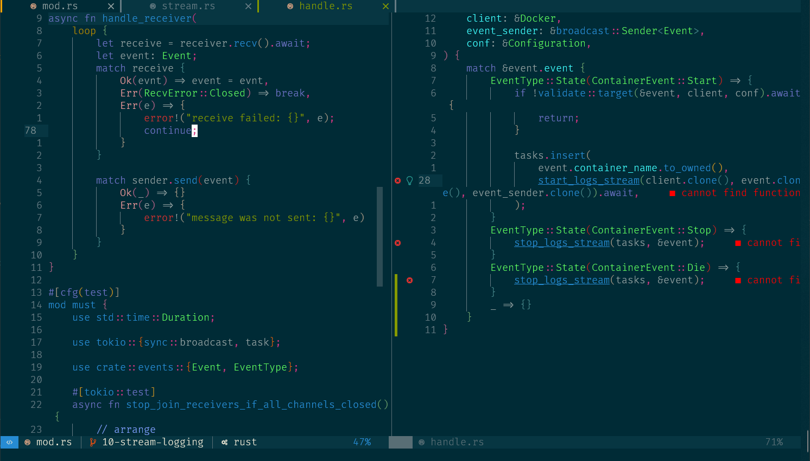
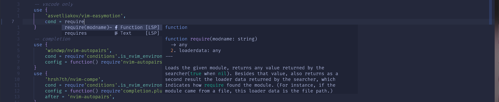

# NeoCode

In my current workflow I use VSCode more and more, because features like remote containers or developing via SSH are not supported in nvim. To be able to work without interruption and not have to use different key bindings everywhere, NeoCode was born. With this configuration I can work fluently in both environments with a only few exceptions.

Beyond the same workflow, you can change themes in a heartbeat. 

Bindings and settings are NOT the best you can get with vim. BUT the ability to switch between both tools without interrupting your flow is worth the trade off imho.

## look & feel

Introducing a nice dashboard ([dashboard-nvim](https://github.com/glepnir/dashboard-nvim)) and statusline ([galaxyline.nvim](https://github.com/glepnir/galaxyline.nvim)).

Navigate files, symbols, grep and more with explorer ([nvim-tree](https://github.com/kyazdani42/nvim-tree.lua)) and search ([telescope.nvim](https://github.com/nvim-telescope/telescope.nvim)).

Keep buffers on sight with a buffer bar ([barbar.nvim](https://github.com/romgrk/barbar.nvim)). Handle your code with lsp support ([nvim-lspinstall](https://github.com/kabouzeid/nvim-lspinstall) & [nvim-treesitter](https://github.com/nvim-treesitter/nvim-treesitter)).

Complete your thoughts with auto completion ([nvim-compe](https://github.com/hrsh7th/nvim-compe)) and snippets ([vim-vsnip](https://github.com/hrsh7th/vim-vsnip)).

Many more plugins are used to round up the experience.

## keymaps

Most standard keymaps of nvim are untouched. You can find a list for custom mappings and exceptions between both environments [here](./docs/keybindings.md).

## setup

### nvim (> 0.5)

Clone or copy the repo into your `.config/nvim` folder and start nvim. The package manager will get installed automatically. After the first start, install all packages with `:PackerInstall` and restart nvim.

Default theme is `solarized-dark` currently. You can change the theme in `lua/settings.lua`. Just look up themes e.g. here <http://chriskempson.com/projects/base16/>.

### vscode

To be able to use vscode accordingly, the following plugins must be installed and set up:

- [Neo Vim](https://marketplace.visualstudio.com/items?itemName=asvetliakov.vscode-neovim)
- [Keyboard Quickfix](https://marketplace.visualstudio.com/items?itemName=pascalsenn.keyboard-quickfix)

Beside these plugins you also have to set keybindings and settings. You can find them [here](./docs/vscode.md).

